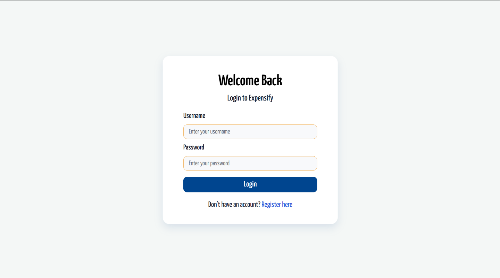
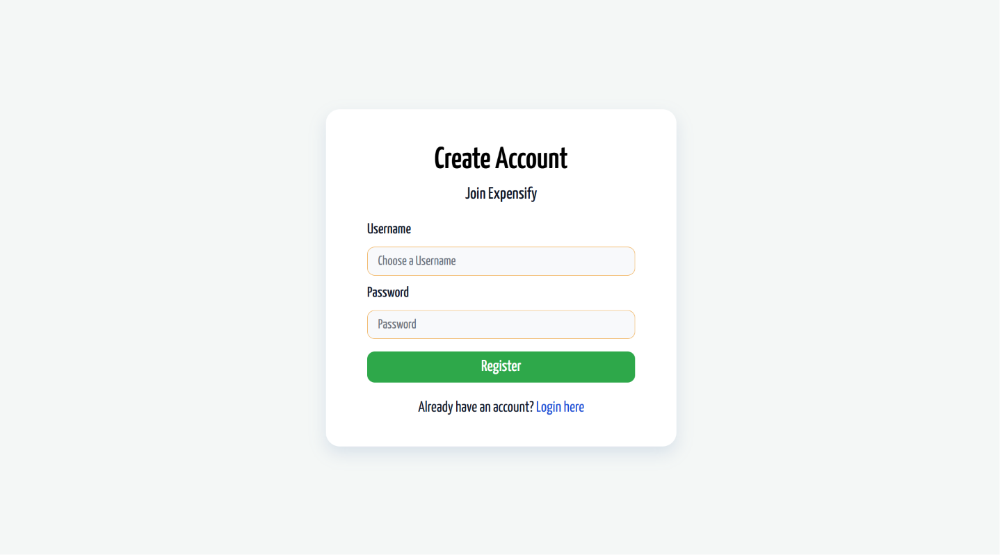
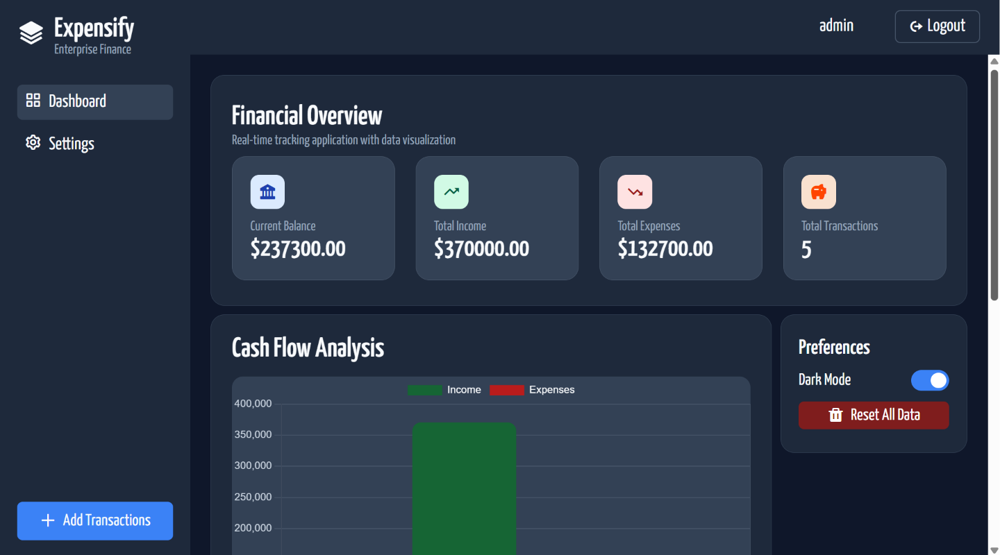
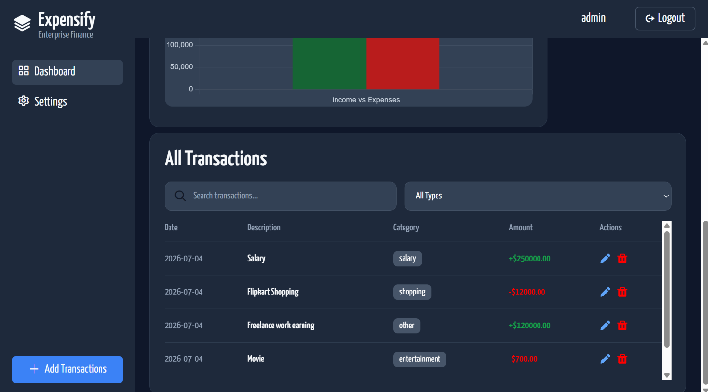
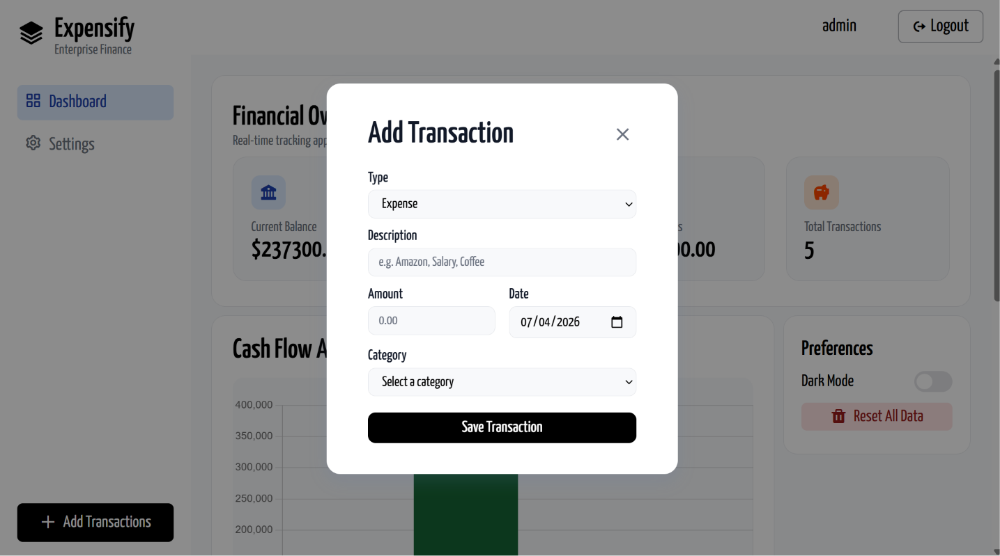
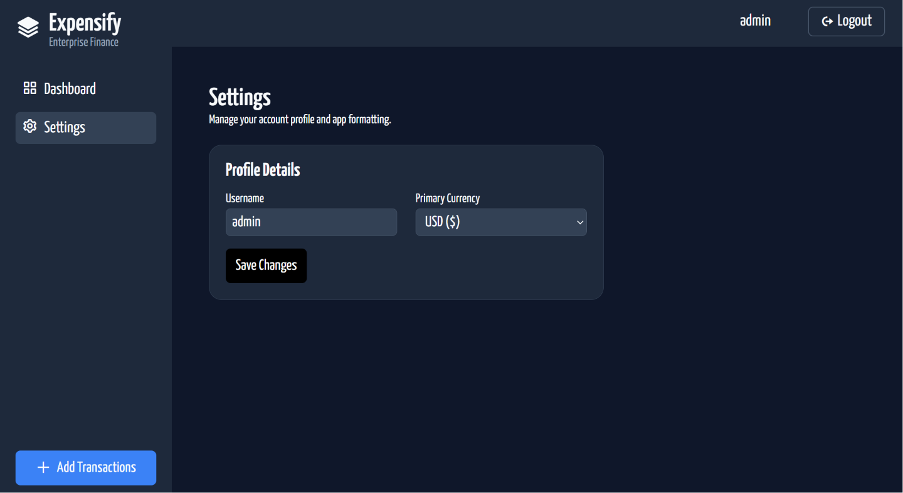
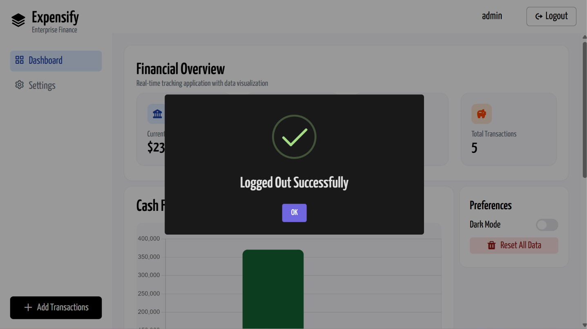

# 💸 Expensify – Personal Finance Tracker

> A modern Personal Finance Management Web Application built with **HTML, CSS and Vanilla JavaScript**.

<p align="center">
  
  
  
  
  
</p>

---

# 🌐 Live Demo

🚀 **Live Website**

> https://amandhakate27.github.io/Expensify--expense-tracker-platform/

---

# 📂 GitHub Repository

> https://github.com/amandhakate27/Expensify--expense-tracker-platform

---

# 📸 Preview

> Add screenshots or GIFs here


[]
[]
[]
[]
[]
[]
[]

---

# ✨ Features

## 🔐 Authentication

- User Registration
- User Login
- Logout
- Persistent Login using LocalStorage
- Duplicate Username Validation
- Session Management

---

## 💰 Transaction Management

- Add Transaction
- Edit Transaction
- Delete Transaction
- Reset User Transactions
- Search Transactions
- Filter by Income / Expense

---

## 📊 Dashboard

- Current Balance
- Total Income
- Total Expense
- Total Transactions
- Real-time Dashboard Updates
- Cash Flow Chart using Chart.js

---

## ⚙️ User Settings

Every user has their own:

- Username
- Preferred Currency
- Theme Preference

Settings are stored separately for each user.

---

## 🌙 Dark Mode

- One-click Theme Switch
- Theme Persistence
- Chart Theme Synchronization
- User-specific Theme

---

## 💾 Local Storage

This project works without any backend.

Data is persisted using LocalStorage.

- Users
- Current User
- Transactions
- User Settings

Everything remains available even after refreshing the browser.

---

# 🏗️ Project Architecture

```
Application

│

├── Authentication

│      ├── Register
│      ├── Login
│      ├── Logout
│      └── Session

│

├── Dashboard

│      ├── Cards
│      ├── Chart
│      ├── Transactions
│      └── Statistics

│

├── Settings

│      ├── Username
│      ├── Currency
│      └── Theme

│

└── Local Storage

       ├── Users
       ├── Current User
       └── Transactions
```

---

# 🔄 Application Flow

```
Application Starts

↓

Load Users

↓

Load Current User

↓

Load Transactions

↓

Is User Logged In?

├── No
│
└── Show Login Page

↓

Login Success

↓

Load User Settings

↓

Load User Transactions

↓

Update Dashboard

↓

Update Chart

↓

User Performs CRUD Operations

↓

Save LocalStorage

↓

Refresh UI

↓

Logout

↓

Clear Current User

↓

Back to Login
```

---

# 🗂️ Data Structure

## Users

```javascript
[
    {
        id,
        username,
        password,
        currency,
        theme
    }
]
```

---

## Transactions

```javascript
[
    {
        id,
        userId,
        type,
        description,
        amount,
        category,
        date
    }
]
```

---

# 🧠 What I Learned From This Assignment

This project was much more than building a finance tracker.

It helped me understand how real-world frontend applications are structured and how different modules communicate with each other.

During this assignment I learned:

- Building complete CRUD functionality
- Authentication without a backend
- User session management
- State management using JavaScript variables
- LocalStorage architecture
- Data persistence
- User-specific data isolation
- Event Delegation
- DOM Manipulation
- Modular function design
- Reusable helper functions
- Dashboard calculations
- Dynamic UI rendering
- Chart.js integration
- SweetAlert2 integration
- Theme persistence
- Currency management
- Application initialization flow
- Clean architecture thinking
- Debugging and logical problem solving

This project significantly improved my understanding of application flow instead of simply writing JavaScript functions.

---

# 💡 Biggest Learning

One of the biggest lessons from this assignment was learning how to think like an application architect.

Instead of focusing only on writing functions, I learned to think about:

- Where should the data live?
- Which object should be the single source of truth?
- How should the UI update after every action?
- How should user-specific data be separated?
- How should state persist after refresh?
- How should different modules communicate?

These concepts changed the way I approach frontend development.

---

# 🛠️ Technologies Used

- HTML5
- CSS3
- Vanilla JavaScript (ES6+)
- Chart.js
- SweetAlert2
- Boxicons
- LocalStorage API

---

# 📁 Folder Structure

```
Expensify/

│── index.html

│── style.css

│── index.js

│── README.md
```

---

# 🙏 Acknowledgements

This project was developed as part of an assignment from **Sheryians Coding School**.

A big thank you to the mentors and the community for creating practical, project-based learning experiences that encourage building real-world applications rather than only learning theory.

---

<p align="center">
Made with ❤️ using HTML, CSS & Vanilla JavaScript -- @amandhakate27
</p>